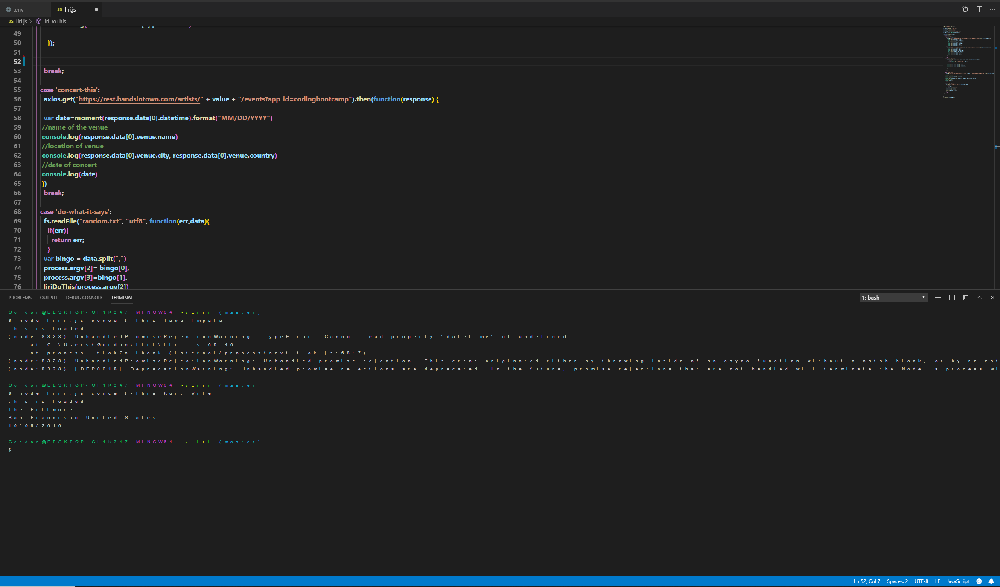

# Liri

Welcome to what is by far the most comprehensive and intelligent artificial intelligence helper that is offered on the market. (It's actually really not) 
Liri is here to help you find concerts and  look up information about your favorite movies and songs. 

After you clone this onto your machine, you're going to want to have a few npm modules installed to make her/him/them pur. 

-------------------------------------------------------------------------

Here is a list of modules 
 ! npm install node-spotify-api - - this lets you look for the songs you want!
 ! npm install moment - - this helps the date inside the concert search appear in a comprehensible format.
 ! npm install axios - - we need this to call our band and movie api. 
 ! npm install dotenv - - because you will need your own api keys, this is the place to store them

-------------------------------------------------------------------------
Instructions for use:
If you're looking for a song use:
"node liri.js spotify-this-song" + "song"

If you're looking for a movie use:
"node liri.js movie-this" + "movie"

If youre interested in a concert use:
"node liri.js concert-this" + "artist name"

-------------------------------------------------------------------------

Images:

-------------------------------------------------------------------------

